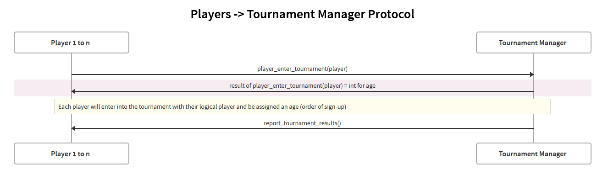
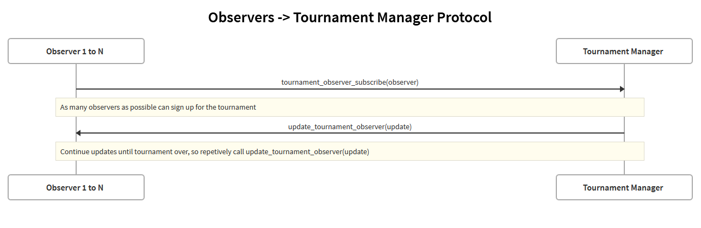
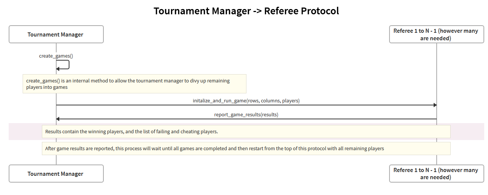

The tournament manager requires at least 3 different protocols between it and other components:
 1. A protocol between the players that are entering the tournament and the tournament manager, so that 
    a player can enter a tournament with a logical player and receive the results of a tournament
 2. A protocol between tournament observers and the tournament manager, so that observers can watch the 
    tournament unfold.
 3. Finally, a protocol between referees and the tournament manager, so that a 
    tournament manager can create referees can run games in the tournament and the referees
    can report the results of their game.
    
We will explain those protocols below and then leave a note on the timing of how all these interfaces are used together.

Firstly however, we will note that we will have a `begin_tournament()` method on the tournament manager interface
that does not interface with any other component. Instead, this would be called by a human operator to begin a 
tournament once the sign-up phase has ended for players.

### Player-Tournament Manager Protocol

1. Players 1 to n (however many sign up) will sign
up for the tournament using the `player_enter_tournament(player)` method to add their logical
player component to the current tournament. 
2. The player will receive back with the `player_enter_tournament(player)` an integer representing their logical player number
in the tournament with 1 returned back for the first player and each player receiving an integer 1 higher than the next
player all the way up to the number n for for the last player. Note that the order of signing up will be determined 
by the communication layer, which will note when remote players have signed-up to put their logical players in the
game.
2. At the end of tournament, players who have not
been kicked from the tournament get results of which players won, identified by their integer number. This
can be used for a player to see if they won or not. Multiple players could win if the last game ends in a tie.

### Observers-Tournament Manager Protocol

1. Observers 1 to n (however many sign up) can subscribe to tournament 
at any point during the tournament using the `tournament_observer_subscribe(observer)` method. Using this method,
they will be subscribed to a specific tournament and will be able to receive updates from the tournament manager
for that tournament.
2. Once subscribed, an observer will receive updates via the tournament manager invoking the observers
`update_tournament_observer(update)` method which will provide statistics and results of who won, who lost games
and so on.

### Referees-Tournament Manager Protocol

1. Once a tournament has been started, a tournament manager will call an internal method `create_games()` to differentiate players
into different lists of games with players in sorted order. This will happen once per round of games, with each
round all eligible players being broken into subgroups of players that will be in size-4 groups until no longer possible,
then permutations of size-2 or size-3 groups in order to accommodate all players. Once all of the players have been
split into groups we can move onto the next step.
2. For each group of players, a referee is created and has their `initialize_and_run_games(rows, columns, players)` called
with enough rows and columns to satisfy the amount of penguins needed for each player. With this method, the referee
will run the game with the specified players, and we can move onto the next step. 
3. Once a game is over, the referee can report the result back to the tournament manager using the tournament manager's
`report_game_results(results)` method, and will note winners of the game as well as any cheating or failing players
to the tournament manager. Winners will remain in the tournament, and losing players will be eliminated from further games.
Losing and cheating players will be kicked from the tournament.
4. Steps 1-3 will repeat until there is 1 or 0 players left (in which case we can declare that player or 0 players to be the winner),
or enough players for a final game in which we can use the results of that game to declare the winner. The final
game could result in a tie (multiple winners), have 1 winner, or have 0 winners (if all players kicked).

### Notes on Timing:
Here we write some notes on the timing of the protocols relative to one another to provide clarity.

- The `player_enter_tournament(player)` must happen before `begin_tournament()`.
- The observers can use `tournament_observer_subscribe(observer)`
at any time and the tournament manager will provide updates after individual games,
individual rounds, and tournaments have completed.
- A single referee instance will exist for only game played between a group of players. In each group of games
played in a round, a referee instance will be created for each.