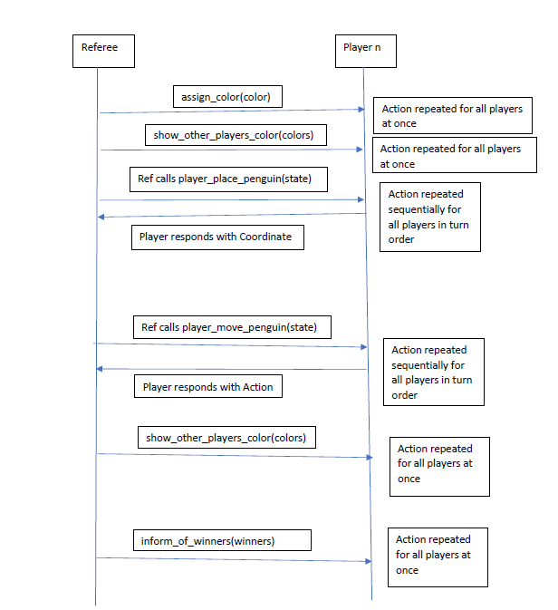

The following protocol is shown in a rough UML-like sequence diagram showing how the player and referee interact. 
Underneath the diagram, we will explain what it is saying and the protocol in precise language.

## Explanation:
We will start with some data definitions that will be helpful to understand the protocol:

`Coordinate: positive integer x, positive integer y` where x and y represents the x and y coordinates
in a double-height hexagonal grid system.

`Action: Coordinate, Coordinate` where an action is a tuple of coordinates representing a move from one 
coordinate to another

`State: FishGameState` where state represents all of the information about a game (state of board, 
information about players, placement of player penguins).

`PlayerColor` where player color is one of the colors "red", "white", "brown", "black" for players in the game.
This is what colors will be represented as in the game.

Now we will go through the protocol:
   1. At the beginning of the game, the referee will tell the player which color it is playing as 
      using the `assign_color(color)` method to each player on the interface. This will be saved internally 
      by the player. The referee will do this for all players in the game
      before any other action to all players in the game.
   2. Next, the referee will tell each player which color the other players are playing as by using 
      the `show_other_players_color(colors)`. This will be saved internally by the player.
      The referee will do this for all players in the game
      before any other action to all players in the game.
   3. The referee will tell the first player to give them a penguin placement using the `player_place_penguin(state)` method.
      It will provide a `State` which provides the info a player needs to place a penguin.
   4. The player will return from the `player_place_penguin(state)` method call back to the referee a `Coordinate`
      which is a placement of the penguins on the board. After the player returns a placement, 
      the referee will modify the state of the game to place the penguin or find this is an illegal action and kick the player
      who returned this invalid action. After this 
      the referee will repeat step 3 sequentially for the next player in the turn order of the game until all 
      penguins have been placed for the players.
   5. Once all penguins have been placed for all players, the referee will tell each player in sequential turn order
      to move one of their penguins using the `player_move_penguin(state)` method.
      It will provide a `State` which provides the info a player needs to move a penguin.
   6. The player will return back from the `player_place_penguin(state)` method call to the referee an `Action` which
      represents the a movement from one coordinate to another.
      After the player returns an `Action`, 
      the referee will modify the state of the game to move the players penguin 
      or find this is an illegal action and kick the player
      who returned this invalid action. After this, the referee will tell the next player (step 5) and steps
      5 and 6 will repeat until there are no more valid moves.
   7. The `show_other_players_color(colors)` method may be resent to all the players if a player is kicked from the game
      to provide updated information to the player.
   8. The `inform_of_winners(winners)` is sent to all players at the end of the game, so they can note who won the game.

Please note that the `player_move_penguin` and `player_place_penguin` methods are used often for turns while the other
methods are only used seldomly (in beginning of game, or when players are kicked, etc.)