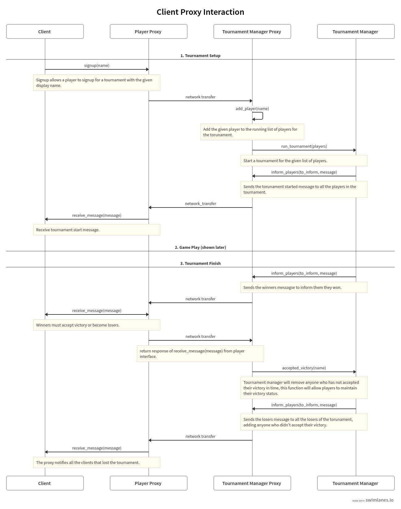
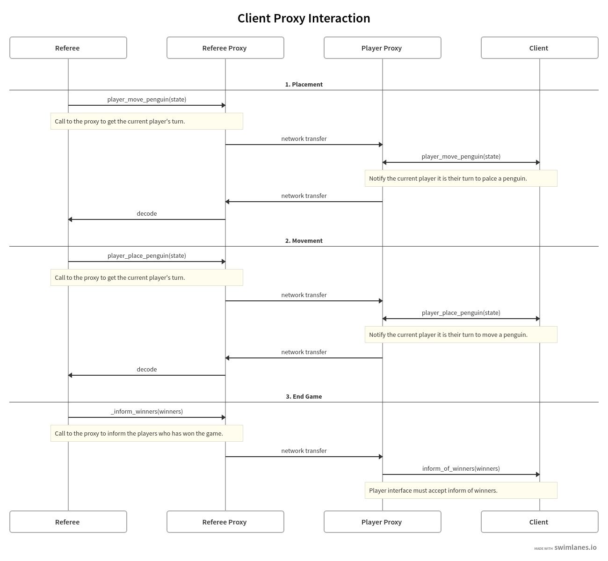

To enable remote communication between Fish.com and external users, we will need to implement a number of
proxies that will allow for communication between components across a network. We will need 3 proxies:
1. A tournament manager proxy will accept incoming traffic and route it to the tournament manager. It will
handle starting and ending tournaments and all messages necessary to inform participants or tournament status.
2. A Referee proxy will accept incoming moves from the players for penguin placement and movement. It will
also inform the winners of specific games that they won.
3. A Player proxy will allow for users to accept incoming traffic from the other proxies and interface
with the player-interface that has already been established. This will handle making placements, moves,
and accepting messages from the other components.
    
We will explain those protocols below and then leave a note on the timing of how all these interfaces are used together.

In all of these diagrams we use the remote proxy pattern. In order to pass data across the network barrier
we will either maintain a dictionary of player names to their respective connection information like the socket
that we are listening to or listen to a single socket and maintain a dictionary of authentication tokens
to players that will allow for us to be sure that the desired player is making the move.

### Tournament Manager Proxy Protocol

1. Clients will send signup messages to their proxy which will route
that information to the tournament manager proxy.
2. At a specified time, the tournament proxy will send the list 
of players it has maintained to the tournament manager to start the tournament.
3. The tournament manager will then inform all of the players that the tournament has begun.
4. All game play will be handled in the Referee Proxy, but once the tournament is over, the tournament proxy
will inform the winners that they have won.
5. Lastly the tournament manager proxy will remove any players who did not accept their win
and inform all the losers, including those who were winners but did not accept,
that they lost.

### Referee Proxy Protocol

1. The referee will start by sending a message to the first player that it is
their turn to place a penguin. This is handled via the Referee proxy who will pass
the request to the Player proxy and receive a placement back. This process will continue
until the placement phase is over and the referee will go into the movement phase.
2. The referee and referee proxy will follow a similar patter for the movement phase but this
time call for a movement action instead of a placement action. This will continue
until their are no moves left and a player had won.
3. Finally the referee will inform the players who won the game using the same patter as the 
tournament manager proxy.

### Notes on Timing:
Here we write some notes on the timing of the protocols relative to one another to provide clarity.

- The player must join the tournament before calling any other functionality.
- The tournament manager must start the tournament before any games are run.
- The referee must request movements before any player sends a placement or movement.
- The players must accept victory at the end of the game to maintain winner status.